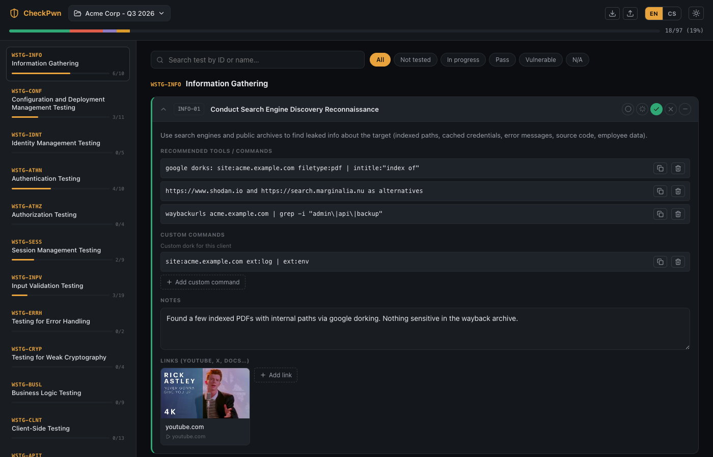
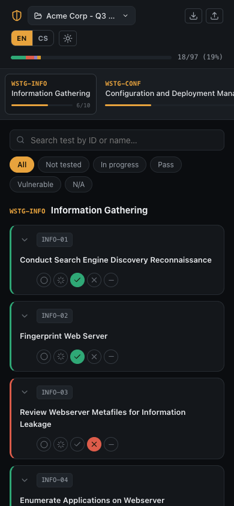

# CheckPwn

A local-first checklist app for penetration testers. It walks you through every chapter of the OWASP Web Security Testing Guide (WSTG v4.2) with built-in guidance and recommended commands, lets you attach your own notes, custom scripts, and reference links to each test, and tracks progress across as many pentest engagements as you need — all stored locally, nothing leaves your machine.


## Features

- Full WSTG checklist (Information Gathering, Authentication, Session Management, Input Validation, API Testing, …) with a short description and recommended tools/commands for every test.
- Set a status per test (not tested / in progress / pass / vulnerable / N/A), add your own notes, custom CLI commands, and links to external material — with automatic YouTube thumbnails.
- Don't need a built-in command? Remove it per test, with one click to restore it later.
- Set a target (domain/IP) per pentest and it's auto-filled into every prepared command — copy, paste, go.
- Progress bar up top for the whole engagement, per-chapter progress in the sidebar.
- Multiple named pentests — switch between them any time, each with its own saved state.
- Autosave to a local JSON file (debounced), plus full export/import.
- English and Czech UI, light and dark mode, responsive layout.



## Getting started

```
npm install
npm run dev
```

This starts the frontend (Vite) on `http://localhost:5173` and a local API server (Express) on `http://localhost:4174` that stores checklists as JSON files in `data/`. Both run together via `npm run dev`.

## Light mode & mobile

<p>
  
  
</p>

## Data

Checklists are saved to `data/<id>.json` — this folder is gitignored, since it can contain sensitive information about an ongoing pentest.
